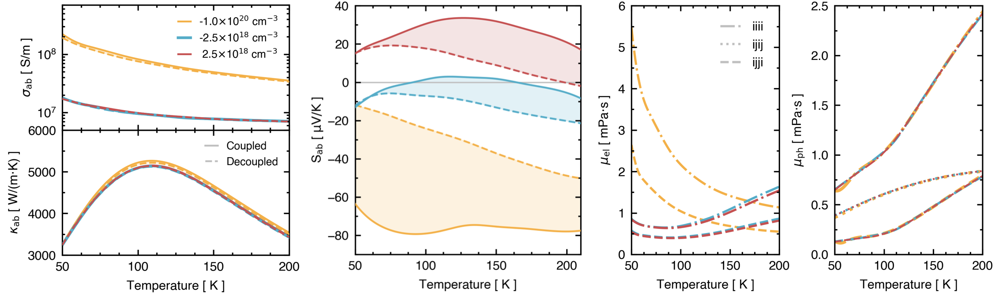
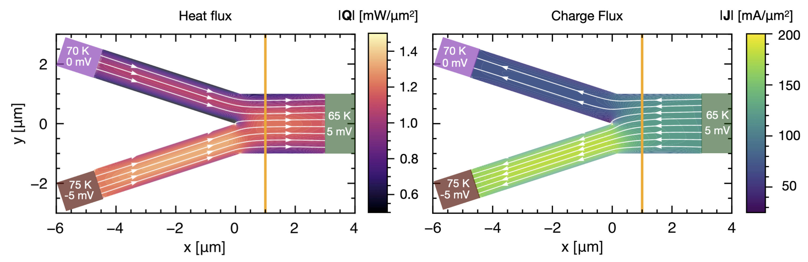

Coupled BTE
======================================

.. raw:: html

  <h4>This section follows the theory of the reference:</h4>
  
| J. Coulter, B. Rajkov, M. Simoncelli. (2025).  
| *Coupled electron-phonon hydrodynamics and viscous thermoelectric equations.*  
| `Link to the ArXiV <>`_   

Here, we outline the high-level perspective of the theory behind this development, but encourage you to study the manuscript before using it.

Introduction
-------------------------------
When we consider the response of electron or phonon populations to a small electric field or thermal gradient, we typically can focus on calculating the out-of-equilibrium population of only the electron or phonon states, assuming the other particles remain at their equilibrium distribution.
However, in some cases, the scattering between electrons and phonon means that if the el or ph population goes out-of-equilibrium, it can cause a shift in the other's distribution as well.
Essentially, this is the **electron-phonon drag effect**, the phenomenon in which out-of-equilibrium electrons induce out-of-equilibrium phonons via electron-phonon scattering, and vice-versa.

In order to predict the phonon drag effect on transport, we have to construct the coupled electron-phonon Boltzmann Transport Equation (epBTE). In Phoebe, we implement the epBTE using a full scattering matrix approach, so that the coupled scattering matrix consists of
the standard electron and phonon scattering matrixes, along with off diagonal drag terms, which couple the independent electron and phonon subspaces. Written out,

.. math::
    -\left[\begin{array}{c|c}
   \mathrm{S}_{\boldsymbol{k} m, \boldsymbol{k}^{\prime} m^{\prime}}^{\mathrm{el}} & \mathrm{D}_{\boldsymbol{k} m, \boldsymbol{q}^{\prime} \nu^{\prime}}^{\mathrm{el}-\mathrm{ph}} \\
   \hline \mathrm{D}_{\boldsymbol{q} \nu, \boldsymbol{k}^{\prime} m^{\prime}}^{\mathrm{ph}-\mathrm{el}} & \mathrm{~S}_{\boldsymbol{q} \nu, \boldsymbol{q}^{\prime} \nu^{\prime}}^{\mathrm{ph}}
   \end{array}\right]\left|\begin{array}{c}
   \delta\mathrm{f}_{\boldsymbol{k}^{\prime} m^{\prime}} \\
   \delta\mathrm{n}_{\boldsymbol{q}^{\prime} \nu^{\prime}}
   \end{array}\right\rangle
   =
   {\left[\begin{array}{c}
   \boldsymbol{v}_{\boldsymbol{k} m}^{\mathrm{el}} \cdot \boldsymbol{\nabla}_{\boldsymbol{r}}+\frac{e}{\hbar}\left[\boldsymbol{\nabla}_{\boldsymbol{r}} V_{\mathrm{eff}}\right] \cdot \boldsymbol{\nabla}_{\boldsymbol{k}} \\
   \boldsymbol{v}_{\boldsymbol{q} \nu}^{\mathrm{ph}} \cdot \boldsymbol{\nabla}_{\boldsymbol{r}}
   \end{array}\right]\left|\begin{array}{c}
   \delta\mathrm{f}_{\boldsymbol{k} m} \\
   \delta\mathrm{n}_{\boldsymbol{q} \nu}
   \end{array}\right\rangle}

where :math:`k,m` are electron wavevector and band indices, and :math:`q,\nu` are phonon wavevector and band indices. :math:`\mathrm{S}` for el and ph are the "self" terms, or the quadrants which involve only electron or phonon states, and the :math:`\mathrm{D}_{\rm ph-el}` and :math:`\mathrm{D}_{\rm el-ph}` terms represent the drag terms.
These are described in detail in the above manuscript. 

When writing the matrix this way, the :math:`\mathrm{S}_{\rm el}` term includes primarily electron-phonon scattering.
The :math:`\mathrm{S}_{\rm ph}` term, depending on user choice, includes phonon-isotope, phonon-phonon, and critically, phonon-electron scattering, which plays the role of "out" scattering on the diagonal of the phonon scattering matrix, corresponding to the "in" scattering from the drag terms.

Relaxons solution
~~~~~~~~~~~~~~~~~~~~~~~~~~~~~~~~~~~~~~~~~~~~~~~~~~~~~~~~~~~~~~~

To solve the epBTE, we use the relaxons solution, which involves a construction of the full scattering matrix, followed by a direct diagonalization.

.. math:: 
   \left[\begin{array}{c|c}
   \mathrm{S}_{\boldsymbol{k} m, \boldsymbol{k}^{\prime} m^{\prime}}^{\mathrm{el}} & \mathrm{D}_{\boldsymbol{k} m, \boldsymbol{q}^{\prime} \nu^{\prime}}^{\mathrm{el}-\mathrm{ph}} \\
   \hline \mathrm{D}_{\boldsymbol{q} \nu, \boldsymbol{k}^{\prime} m^{\prime}}^{\mathrm{ph}-\mathrm{el}} & \mathrm{~S}_{\boldsymbol{q} \nu, \boldsymbol{q}^{\prime} \nu^{\prime}}^{\mathrm{ph}}
   \end{array}\right]\left|\begin{array}{c}
   \theta_{\boldsymbol{k} m} \\
   \theta_{\boldsymbol{q} \nu}
   \end{array}\right\rangle_{\gamma}
   =\frac{1}{\tau_\gamma}
   {\left|\begin{array}{c}
   \theta_{\boldsymbol{k} m} \\
   \theta_{\boldsymbol{q} \nu}
   \end{array}\right\rangle_{\gamma}}

In the case where drag is not present, the relaxons are decoupled entirely into pure electron or pure phonon eigenvectors, 
with zeros for the other quandrant, and the eigenvalue, the inverse of the relaxation time for the collective relaxon excitation, will be associated with either a purely electron or phonon excitation. 

In the more interesting case when drag effects are meaningful, the **eigenvectors can become mixed, with both electron and phonon states participating**. 

Transport predictions
~~~~~~~~~~~~~~~~~~~~~~~~~~~~~~~~~~~~~~~~~~~~~~~~~~~~~~~~~~~~~~~

Once we've set up this problem and diagonalized the matrix, with eigenvectors and values in hand, we can calculate the transport coefficients. 
We do this by transforming to the relaxons basis, 
where I now convert to a shorthand for the eigenvector, :math:`\normalsize|\theta^\gamma_{^{\boldsymbol{k}m}_{\boldsymbol{q}\nu}}\normalsize\rangle`, 

.. math:: 
   
   \Omega_{^{\boldsymbol{k}m, \boldsymbol{k}'m'}_{\boldsymbol{q}\nu, \boldsymbol{q}'\nu'}} = \frac{1}{\tau_\gamma}
   \normalsize|\theta^\gamma_{^{\boldsymbol{k}m}_{\boldsymbol{q}\nu}}\normalsize\rangle \normalsize\langle\theta^\gamma_{^{\boldsymbol{k}'m'}_{\boldsymbol{q}'\nu'}}\normalsize|
   
This way, the transport coefficients can be written in terms of the eigenvectors of the coupled matrix along with several "special" eigenvectors related to conserved quantities. 
These are:
   
   * :math:`\theta^e_{^{\boldsymbol{k}m}_{\boldsymbol{q}\nu}}` -- the eigenvector related to the conservation of charge,
   * :math:`\theta^0_{^{\boldsymbol{k}m}_{\boldsymbol{q}\nu}}` -- the eigenvector related to the conservation of energy, 
   * :math:`\phi^i_{^{\boldsymbol{k}m}_{\boldsymbol{q}\nu}}` -- the eigenvector related to the quasi-conservation of crystal momentum. 
   
While the final type (of which there are 3, for Cartesian index i) is not typically a stationary state of the scattering matrix, but instead found with finite lifetime, the first two must be and should have (within numerical limitations) a zero eigenvalue.
These are discussed at length and defined in the manuscript, but here for conciseness, we proceed to use them. 

**From these, the transport coefficients can be calculated** 

As noted in the above manuscript (as well as in previous manuscripts describing the relaxons formalism), the relaxons eigenvectors have a well-defined parity, 
with odd parity modes contributing to conductivities. 

Note, in the follwing expressions, the values of :math:`U,A,C` are the specific charge, momentum and heat, and :math:`v` are electron or phonon group velocities. 

* **Electrical conductivity:**

.. math::
   
   \sigma^{ij} = U 
   \normalsize\langle \theta^e_{^{\boldsymbol{k}m}_{\boldsymbol{q}\nu}} | v^i_{^{\boldsymbol{k}m}_{\boldsymbol{q}\nu}} | \theta^\gamma_{^{\boldsymbol{k}m}_{\boldsymbol{q}\nu}} \normalsize\rangle 
   \normalsize\langle \theta^\gamma_{^{\boldsymbol{k}'m'}_{\boldsymbol{q}'\nu'}} | v^j_{^{\boldsymbol{k}'m'}_{\boldsymbol{q}'\nu'}} | \theta^e_{^{\boldsymbol{k}'m'}_{\boldsymbol{q}'\nu'}} \normalsize\rangle
   \tau_\gamma

* **Total thermal conductivity:**

.. math::
   
   \kappa^{ij} = C_{tot} 
   \normalsize\langle \theta^0_{^{\boldsymbol{k}m}_{\boldsymbol{q}\nu}} | v^i_{^{\boldsymbol{k}m}_{\boldsymbol{q}\nu}} | \theta^\gamma_{^{\boldsymbol{k}m}_{\boldsymbol{q}\nu}} \normalsize\rangle 
   \normalsize\langle \theta^\gamma_{^{\boldsymbol{k}'m'}_{\boldsymbol{q}'\nu'}} | v^j_{^{\boldsymbol{k}'m'}_{\boldsymbol{q}'\nu'}} | \theta^0_{^{\boldsymbol{k}'m'}_{\boldsymbol{q}'\nu'}} \normalsize\rangle
   \tau_\gamma
   
* **Thermoelectric coefficients:**

.. math::
   
   \left[\sigma S\right]^{ij} = \sqrt{U C_{tot}}
   \normalsize\langle \theta^e_{^{\boldsymbol{k}m}_{\boldsymbol{q}\nu}} | v^i_{^{\boldsymbol{k}m}_{\boldsymbol{q}\nu}} | \theta^\gamma_{^{\boldsymbol{k}m}_{\boldsymbol{q}\nu}} \normalsize\rangle 
   \normalsize\langle \theta^\gamma_{^{\boldsymbol{k}'m'}_{\boldsymbol{q}'\nu'}} | v^j_{^{\boldsymbol{k}'m'}_{\boldsymbol{q}'\nu'}} | \theta^0_{^{\boldsymbol{k}'m'}_{\boldsymbol{q}'\nu'}} \normalsize\rangle
   \tau_\gamma
   
.. math::
   
   \alpha^{ij} = \sqrt{C_{tot} U T}
   \normalsize\langle \theta^e_{^{\boldsymbol{k}m}_{\boldsymbol{q}\nu}} | v^i_{^{\boldsymbol{k}m}_{\boldsymbol{q}\nu}} | \theta^\gamma_{^{\boldsymbol{k}m}_{\boldsymbol{q}\nu}} \normalsize\rangle 
   \normalsize\langle \theta^\gamma_{^{\boldsymbol{k}'m'}_{\boldsymbol{q}'\nu'}} | v^j_{^{\boldsymbol{k}'m'}_{\boldsymbol{q}'\nu'}} | \theta^0_{^{\boldsymbol{k}'m'}_{\boldsymbol{q}'\nu'}} \normalsize\rangle
   \tau_\gamma
   
**From the even relaxons, we can calculate electron viscosities,** 

* **Electron Viscosity**

.. math::
   
   \eta_{\mathrm{el}}^{ijkl} = \sqrt{A_{el}^{i}A_{el}^{k}} \sum_{\gamma \neq e,0}
   \normalsize\langle \phi^i_{^{\boldsymbol{k}m}} | v^j_{^{\boldsymbol{k}m}} | \theta^\gamma_{^{\boldsymbol{k}m}} \normalsize\rangle 
   \normalsize\langle \theta^\gamma_{^{\boldsymbol{k}'m'}} | v^l_{^{\boldsymbol{k}'m'}} | \phi^k_{_{\boldsymbol{k}'m'}} \normalsize\rangle
   \tau_\gamma
   
* **Phonon Viscosity**

.. math::
   
   \eta_{\mathrm{ph}}^{ijkl} = \sqrt{A_{ph}^{i}A_{ph}^{k}} \sum_{\gamma \neq e,0}
   \normalsize\langle \phi^i_{\boldsymbol{q}\nu} | v^j_{\boldsymbol{q}\nu} | \theta^\gamma_{\boldsymbol{q}\nu} \normalsize\rangle 
   \normalsize\langle \theta^\gamma_{\boldsymbol{q}'\nu'} | v^l_{\boldsymbol{q}'\nu'} | \phi^k_{\boldsymbol{q}'\nu'} \normalsize\rangle
   \tau_\gamma
   
* **Drag Viscosity**

   Also note the corresponding defintion exists for :math:`\eta_{\mathrm{ph}\ \mathrm{drag}}^{ijkl}`. 

.. math::
   
   \eta_{\mathrm{ph}\ \mathrm{drag}}^{ijkl} = \sqrt{A_{ph}^{i}A_{el}^{k}} \sum_{\gamma \neq e,0}
   \normalsize\langle \phi^i_{\boldsymbol{q}\nu} | v^j_{\boldsymbol{q}\nu} | \theta^\gamma_{\boldsymbol{q}\nu} \normalsize\rangle 
   \normalsize\langle \theta^\gamma_{\boldsymbol{k}m} | v^l_{\boldsymbol{k}m} | \phi^k_{\boldsymbol{k}m} \normalsize\rangle
   \tau_\gamma
      
These can be calculated using Phoebe, as shown here for graphite. 
To understand the effect of drag, essentially, one should run both the pure el/ph calculation, as well as the dragged one -- then take the difference. 
      

|

Mesoscopic transport simulations
~~~~~~~~~~~~~~~~~~~~~~~~~~~~~~~~~~~~~~~~~~~~~~~~~~~~~~~~~~~~~~~

In addition to the prediction of bulk transport properties, we can also utilize these coefficients to calculate mesoscale/device scale transport effects. 
This is done through the calculate of several additional coefficients related to momentum flux, which are calculated using Phoebe, 
and postprocessed using the toolkit provided by the ``SolViTe`` package.  

These additional coefficients are:

**Electron and phonon momentum dissipation tensors:** 
which account for the decay of electron and phonon momentum, 

.. math::
   
   D^{ij}_{\mathrm{ee}} = \sqrt{A_{el}^{i}A_{el}^{j}}
   \normalsize\langle \phi^i_{\boldsymbol{k}m} \normalsize| 
   \Omega_{\boldsymbol{k}m, \boldsymbol{k}'m'} \normalsize| 
   \phi^j_{\boldsymbol{k}'m'} \normalsize\rangle 
   
.. math::
   
   D^{ij}_{\mathrm{ep}} = \sqrt{A_{ph}^{i}A_{el}^{j}}
   \normalsize\langle \phi^i_{\boldsymbol{k}m} \normalsize| 
   \Omega_{^{\boldsymbol{k}m, \boldsymbol{q}\nu}} \normalsize| 
   \phi^j_{\boldsymbol{q}\nu} \normalsize\rangle 
   
.. math::
   
   D^{ij}_{\mathrm{pe}} = \sqrt{A_{el}^{i}A_{ph}^{j}}
   \normalsize\langle \phi^i_{\boldsymbol{q}\nu} \normalsize| 
   \Omega_{\boldsymbol{q}\nu,\boldsymbol{k}m} \normalsize| 
   \phi^j_{\boldsymbol{k}m} \normalsize\rangle 
   
.. math::
   
   D^{ij}_{\mathrm{pp}} = \sqrt{A_{ph}^{i}A_{ph}^{j}}
   \normalsize\langle \phi^i_{\boldsymbol{q}\nu} \normalsize| 
   \Omega_{\boldsymbol{q}\nu, \boldsymbol{q}'\nu'} \normalsize| 
   \phi^j_{\boldsymbol{q}'\nu'} \normalsize\rangle 
   

**Momentum contribution to transport:** 
Additionally we need the transport coefficients which account for the momentum contribution to transport, 

.. math::
   
   \chi^{ij}_{\mathrm{e}} = \sqrt{\frac{C_{tot}A_{el}^{j}}{T}}
   \normalsize\langle \theta^0_{\boldsymbol{k}m} \normalsize| 
   v^i_{\boldsymbol{k}m} \normalsize| 
   \phi^j_{\boldsymbol{k}'m'} \normalsize\rangle 
   
.. math::
   
   \chi^{ij}_{\mathrm{p}} = \sqrt{\frac{C_{tot}A_{ph}^{j}}{T}}
   \normalsize\langle \theta^0_{\boldsymbol{q}\nu} \normalsize| 
   v^i_{\boldsymbol{q}\nu} \normalsize| 
   \phi^j_{\boldsymbol{q}'\nu'} \normalsize\rangle 
   
   
From these coefficients, we can then write the **Viscous Thermoelectric Equations (VTE)**, 
which enable us to predict coupled electron-phonon transport and the properties of electron-phonon bifluids 
at the mesoscale, 

.. math::
   -\psi^{i j} \frac{\partial u_e^i}{\partial r^j}-\tilde{\sigma}^{i j} 
   \frac{\partial^2 V_{eff}}{\partial r^i \partial r^j}
   -[\tilde{\sigma} \tilde{S}]^{i j} \frac{\partial^2 T}{\partial r^i \partial r^j}=0

.. math:: 
   \bar{T} \chi_e^{i j} \frac{\partial u_e^i}{\partial r^j}
   +\bar{T} \chi_p^{i j} \frac{\partial u_p^i}{\partial r^j}
   -\tilde{\alpha}^{i j} \frac{\partial^2 V_{\mathrm{eff}}}{\partial r^i \partial r^j}
   -\bar{\kappa}^{i j} \frac{\partial^2 T}{\partial r^i \partial r^j}=0
   
.. math::
   \chi_e^{i j} \frac{\partial T}{\partial r^j}
   -\psi^{i j} \frac{\partial V_{\mathrm{eff}}}{\partial r^j}
   -\eta_{\mathrm{el}}^{i j k l} \frac{\partial u_e^k}{\partial r^j \partial r^l}
   -\eta_{\mathrm{el}\ \mathrm{drag}}^{i j k l} \frac{\partial u_p^k}{\partial r^j \partial r^l}
   =-D_{\mathrm{ee}}^{i j} u_e^j-D_{\mathrm{ep}}^{i j} u_p^j
   
.. math::
   \chi_p^{i j} \frac{\partial T}{\partial r^j}
   -\eta_{\mathrm{ph}}^{ijkl} \frac{\partial u_p^k}{\partial r^j \partial r^l}
   -\eta_{\mathrm{ph}\ \mathrm{drag}}^{ijkl} \frac{\partial u_e^k}{\partial r^j \partial r^l}
   =-D_{\mathrm{pp}}^{ij} u_p^j
   -D_{\mathrm{pe}}^{ij} u_e^j
   
   
which reduce to the Gurzhi equation, the Viscous Heat Equations, or diffusive thermoelectric equations in certain limits. 
Using ``SolViTe``, one can use finite element differential equation solutions to produce the solution to these equations for
a non-trivial sample geometry, as exemplified below for a mixing device with specified boundary conditions. 

|