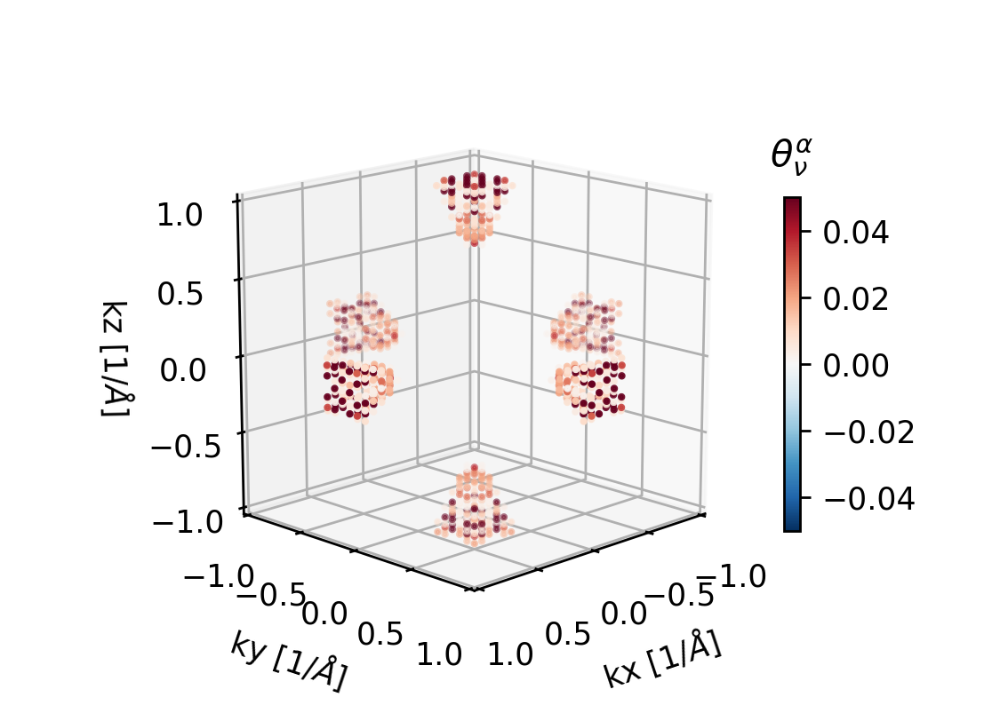
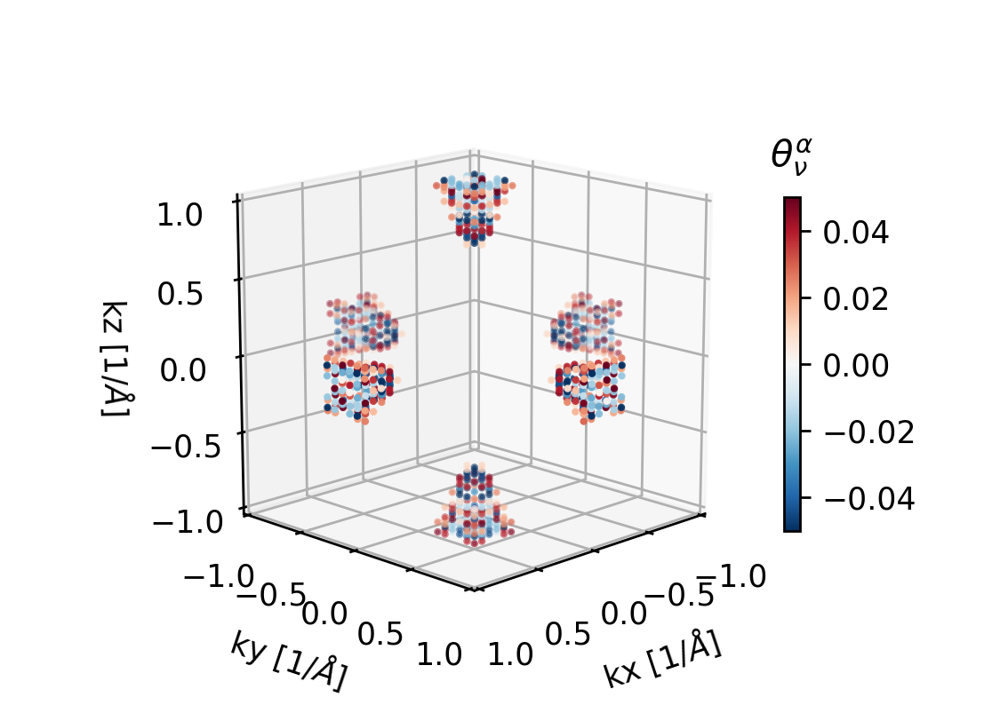
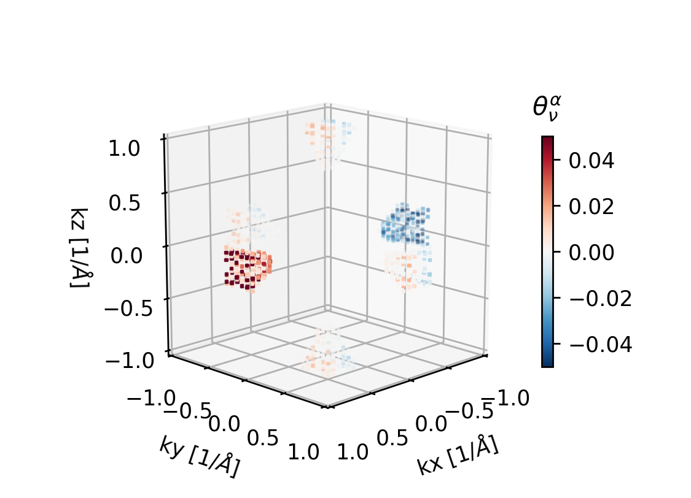
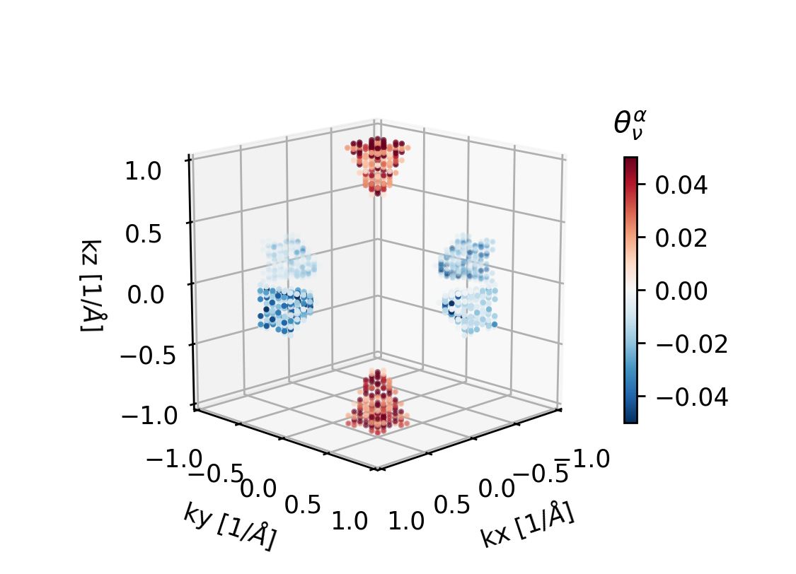

.. _relaxons:

Relaxons Tutorial
=========================

Overview
--------

As detailed in the theory section, one solution to the BTE within Phoebe is the relaxons solver. As with the other solvers, the relaxons solver can be used for both electrons and phonons, but also can be used to construct and solve the coupled BTE, as shown in the :ref:`tutorialCBTE` section. 
This solver has the unique capability to access a spectral analysis of the scattering matrix in addition to providing bulk transport properties, and we will demonstrate this analysis in the tutorial below. 

We note that the :ref:`elWanTransport` and :ref:`phononTransport` also demonstrate how to run the relaxons solver, but that here we offer more details.
Here, we first comment on some of the specific input file options related to it, and then we aim to provide additional information about analyzing data from the solver, and several considerations one should keep in mind when using it. 

Step 1: Running the Relaxons Solver
-------------------------------------------

After running the :ref:`elWanTransport` or :ref:`phononTransport` transport calculation to generate the necessary input files, one can run a relaxons BTE calculation using Phoebe (for an example below of the electronWannierTransport application)::

  appName = "electronWannierTransport"
  phFC2FileName = "silicon.fc"
  sumRuleFC2 = "crystal"
  electronH0Name = "si_tb.dat",
  elphFileName = "silicon.phoebe.elph.hdf5"

  kMesh = [35,35,35]
  temperatures = [100.]
  dopings = [-1e21]

  smearingMethod = "gaussian"
  smearingWidth = 0.05 eV
  windowType = "population"
  windowPopulationLimit = 1e-4

  useSymmetries = false
  scatteringMatrixInMemory=true
  symmetrizeMatrix = true
  enforceDetailedBalance = true
  numRelaxonsEigenvalues = 0
  solverBTE = ["relaxons"]

where here we note the transport calculation is a demo, and therefore will be unconverged. However, we can highlight a things about this calculation. 

* We use Gaussian smearing. The need to use Gaussian smearing to preserve the properties of the scattering matrix is mentioned in Ref. [2]. 
* We use the population window to prevent the scattering matrix from becoming too big. Here, we apply a somewhat rough cutoff, which one should increase and convergence against. 
* Next comes a block of inputs related to the storage of the scattering matrix and the use of the solver. 
	* :ref:`useSymmetries` = `false` -- the theory of the relaxons solver when using symmetries in the BTE is not currently established. 
	* :ref:`scatteringMatrixInMemory` = `true` -- We store the scattering matrix in memory, which is required for the relaxons solution. 
	* :ref:`symmetrizeMatrix` = `true` -- this will symmetrize the scattering matrix (by which we mean, apply :math:`(\tilde{\Omega} + \tilde{\Omega}.T)/2`). This can provide a bit of extra numerical stability if there are slight errors in the Wannier/Fourier interpolation of bandstructures or coupling matrix elements. It is good to do a test calculation with this on and off, to make sure the symmetrization is not artificially covering up some significant issue with the scattering matrix. 
	* :ref:`numRelaxonsEigenvalues` = `0` -- this can be used to speed up the diagonalization of the scattering matrix by only calculating the topmost N relaxons. By supplying zero (the default value), we here tell the code to calculate all of them instead. 
	* :ref:`solverBTE` = `["relaxons"]` -- this runs the relaxon solution to the BTE (as well as the RTA as a default).

.. note::
  See here that we use an odd number of wavevectors. This is necessary to correctly capture the parity of the relaxons coming out of the BTE solution (where relaxon parity is discussed in Ref. [4]). 

.. _relaxonsParallelism:

Parallelism for the relaxons solver 
~~~~~~~~~~~~~~~~~~~~~~~~~~~~~~~~~~~
The relaxons solver requires the calculation of the scattering matrix, which can be quite intense because it involves storing something rather large in memory, and also requires that we calculate all the scattering rates contributing to the scattering matrix. 

**This is alleviated by:**
  * the scattering matrix is distributed in memory using MPI via ScaLAPACK
  * the scattering rate calculations are hybrid OpenMP/MPI hybrid parallel, and you should see a performance optimum with a combination of both. 
  * the diagonalization of the scattering matrix is done using MPI only (as this is what ScaLAPACK can use).

Step 2: Analyzing the relaxons solution
--------------------------------------------------------
We start by reminding the user that the relaxons solution to the BTE corresponds to setting up a properly symmetrized scattering matrix, :math:`\tilde{\Omega}_{\nu,\nu'}`, and diagonalizing it, to calculate its eigenvalues, :math:`\tau_\alpha` and eigenvectors, :math:`\theta^\alpha_\nu`. 

.. _negativeEigenvalues:

Negative eigenvalues
~~~~~~~~~~~~~~~~~~~~

Because the matrix is known to be positive semi-definite, (Ref [2]), all the relaxons eigenvalues should be positive. 
However, due to numerical issues, if there are problems with the quality of your scattering matrix, you may see negative eigenvalues from the diagonalization. This must be fixed before you can analyze the results!
As noted above, you can try the inputs ``symmetrizeMatrix = true`` or increasing the number of wavevectors, or changing the smearing to better match the wavevector grid choice. In some cases, you have numerical issues due to poor Wannierization of the electronic structure and electron-phonon matrix elements, as well. 

.. important::
    If you have negative eigenvalues, and they are not very very small (~1e-20), or clearly due to the Gamma point acoustic phonon modes or the energy or charge eigenvectors, you cannot use the output of the solver!
    The contribution associated with the negative eigenvalue relaxon will be discarded in the output because it is meaningless, and as a result the transport calculation is not reliable. 

Relaxons eigenvectors 
~~~~~~~~~~~~~~~~~~~~~~

We recall from the theory documentation that the relaxons solution to the BTE is as follows, where it is important to note that :math:`\tilde{\Omega}` is the appropriately symmetrized scattering matrix (see discussion in Refs [3,4]).

.. math::
   \sum_{\nu'} \tilde{\Omega}_{\nu,\nu'} \theta^\alpha_{\nu} = \frac{1}{\tau_\alpha} \theta^\alpha_{\nu}

We can learn a lot about both the numerical quality and the physics of the scattering matrix from its eigenvectors and eigenvalues. 

First, we can learn a lot about the numerical quality of the scattering matrix by looking at the appearance of two special eigenvectors related to different kinds of local equilibrium. Analytically, these must appear -- but practically, if something is wrong with the scattering matrix, they may not. 

**The charge eigenvector** -- this is a symmetrization factor as an eigenvector of the scattering matrix. In the electronic case, we always expect to find this. 

.. math::
   \theta^e_{\nu} \propto \sqrt{f_{\nu} (f_{\nu}-1)}
   
**The energy eigenvector** is related to the conservation of energy, and is the result of having local thermal equilibrium. It is represented by either :math:`\hbar\omega` or :math:`\epsilon_{\nu} - \mu`  for electrons :math:`\times` a symmetrization factor. 

.. math::
   \theta^0_{\nu} \propto \sqrt{f_{\nu} (f_{\nu}-1)} (\epsilon_{\nu} - \mu)
   
Information about these special eigenvectors is written at the end of the Phoebe calculation. You will see things like the below out print out, which tell you the scalar product of the calculated eigenvectors of the scattering matrix with the analytical eigenvectors written above.::

    Maximum scalar product theta_e.theta_alpha = 0.8586 at alpha = 0.
    First ten products with theta_e: 0.8586 0.0339 0.0693 0.0604 0.0536 0.0052 0.0321 0.1045 0.0608 0.0407

**In the phonon case,** you have a good quality of scattering matrix if the energy eigenvector is well found (something like ~0.99 is ideal), and is appearing at least close to the top of the list of eigenvectors. In the phonon case, you will also see the appearance of three essentially perfect zero eigenvalues/vectors related to the acoustic phonon modes. In this case, there is of course no charge to worry about. 

**In the electronic case**, things are slightly more nuanced. You should see the charge eigenvector appearing with again, a nearly ideal value such as ~0.99 overlap. However, if using electron-phonon scattering, the energy eigenvector will be found rather poorly -- this is because essentially, the scattering matrix for electrons is incomplete, allowing energy to be lost to phonons, but not to be put back in, if one uses electron-phonon scattering but not the corresponding phonon drag terms (see :ref:`theoryCBTE`).

**Other practical reasons to find bad overlap of the special eigenvectors include:**
  * The type of smearing you have used can cause problems with the positive semi-definite nature of the scattering matrix (see appendix of Ref. [2] for discussion). Gaussian smearing should be used. 
  * If you have performed a calculation where the smearing is too large, or correspondingly the number of wavevectors is too small, the special eigenvectors will be poorly found. 
  * If the interpolation of quantities you are using to calculate scattering rates are poor, for example, if you have chosen a bad Wannierization, you can find issues like poor special eigenvectors. 

**The momentum eigenvectors** are a third set of special eigenvectors which can emerge at least partially, in particular, at lower temperatures, which correspond to the conservation of crystal momentum (either :math:`k` or :math:`q` for electrons or phonons). There are three of these eigenvectors along Cartesian directions :math:`i=x,y,z` While in a hypothetical material in which there is no Umklapp scattering, these would be zero modes, they are in realistic systems non-zero (see Ref. [1]). 

.. math::  
   \phi^i_{\nu}  \propto \sqrt{f_{\nu} (f_{\nu}-1)}\ \hbar k_i

Output and Post-Processing 
--------------------------

As anticipated, we will find several output files related to bulk transport coefficients, which are in the format:
  
  * ``relaxons_*_viscosity.json``
  * ``relaxons_onsager_coefficients.json`` (for electrons) or ``relaxons_phonon_thermal_conductivity.json`` (for phonons)
  * ``relaxons_*_real_space_coefficients.json``
  * ``relaxons_*_relaxation_times.json``
  
Where ``*`` here can be either ``el`` or ``ph`` depending on what kind of calculation is run.

Beyond what is printed out by Phoebe about the special eigenvectors, we can also inspect the eigenvectors which make the largest contribution to the scattering matrix, which are output by Phoebe. 
The top 50 eigenvectors will be output by Phoebe into the file ``relaxons_el_eigenvectors.hdf5`` or ``relaxons_ph_eigenvectors.hdf5``.
These files also include the analytical special eigenvectors as mentioned above. 

Using the script provided in ``phoebe/plotScripts/relaxons_eigenvectors.py``, we can visualize these. For electrons, they take the form of deformations of the Fermi surface of non-eq. populations -- this is proportional to the contribution to the total :math:`\delta f` from each relaxon, :math:`\delta f^{\theta_\alpha}_{\nu}` (proportional only, because the eigenvectors are normalized to one during the diagonalization). 
Below, we have for the above silicon calculation, plotted in the Wigner-Seitz cell, eigenvectors :math:`\theta_e`, :math:`\theta_0`, :math:`\phi_x` and the relaxon with the third longest relaxation time, :math:`\theta^{\alpha=3}_\nu`. 

.. raw:: latex

   \newline

.. raw:: latex

   \newpage

References 
-----------
| [1] R. Hardy. "Phonon Boltzmann Equation and Second Sound in Solids." `Physical Review B, 2, 1193 (1970). <https://doi.org/10.1103/PhysRevB.2.1193>`_  
| [2] G. Fugallo, M. Lazzeri, L. Paulatto, & F. Mauri. "Ab initio variational approach for evaluating lattice thermal conductivity." (2013). `Physical Review B 88(4), 045430. <https://doi.org/10.1103/PhysRevB.88.045430>`_  
| [3] A. Cepellotti and N. Marzari. "Thermal transport in crystals as a kinetic theory of relaxons." (2016). `Physical Review X_ 6.4, 041013 <https://doi.org/10.1103/PhysRevX.6.041013>`_  
| [4] M. Simoncelli, N. Marzari, A. Cepellotti. "Generalization of Fourier’s Law into Viscous Heat Equations." (2020). `Physical Review X 10, 011019 <https://doi.org/10.1103/PhysRevX.10.011019>`_  
| [5] J. Coulter, B. Rajkov, M. Simoncelli. "Generalization of Fourier’s Law into Viscous Heat Equations." (2025). `arXiv:2503.07560 <https://arxiv.org/abs/2503.07560>`_ 
