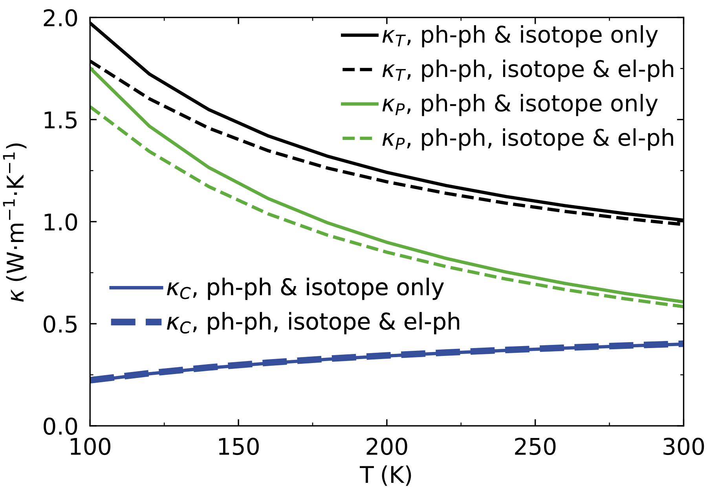

.. _wignerPhononTransport:

Wigner Phonon (ph-el+ph-ph) Transport Tutorial
==============================================

Synopsis
--------

This page explains how to compute the thermal conductivity from the
solution of the Wigner transport equation (WTE) `M. Simoncelli, N.
Marzari, F. Mauri; Nat. Phys. 15, 809
(2019) <https://doi.org/10.1038/s41567-019-0520-x>`__ accounting for
electron-phonon, phonon-phonon and isotope scattering.
Specifically, we will showcase calculation of the phonon contribution 
to the thermal transport in a metal organic framework Cu-BHT as
discussed in `H. Un et
al.; Nat. Comm. 16, 6628 (2025) <https://www.nature.com/articles/s41467-025-61920-w>`__.

The Wigner transport equation generalizes the Boltzmann transport
equation (BTE), accounting for both the particle-like propagation
transport mechanism present in the BTE as well as wave-like tunnelling
between modes whose energy difference is smaller than sum of their
energy uncertainties. Accounting for both of these transport mechanisms
allows to comprehensively describe thermal transport in materials
ranging from crystals to glasses. The Wigner thermal conductivity
expression can be written in terms of two contributions:
:math:`\kappa_{\rm T} = \kappa_{\rm P} + \kappa_{\rm C}`, where
:math:`\kappa_{\rm P}` is the conductivity as predicted from BTE and
:math:`\kappa_{\rm C}` is the “coherence” contribution, equal to:

.. math::

   \kappa_{\rm C}^{\alpha \beta}{=}\frac{1}{\mathcal{V}{N_{\rm c}} } \sum_{\boldsymbol{q}} {\sum_{s, s' \neq s}}    \frac{\omega_{\boldsymbol{q}s}{+}\omega_{\boldsymbol{q}s'}}{4}\!\left(\frac{C_{\boldsymbol{q}s}}{\omega_{\boldsymbol{q}s}}{+}\frac{C_{\boldsymbol{q}s'}}{\omega_{\boldsymbol{q}s'}}\right) V^\alpha (\boldsymbol{q})_{s, s'} V^\beta(\boldsymbol{q})_{s', s}  \frac{\frac{1}{2} [\Gamma_{\boldsymbol{q}s}{+}\Gamma_{\boldsymbol{q}s'}]}{[\omega_{\boldsymbol{q}s}-\omega_{\boldsymbol{q}s'}]^2 + \frac{1}{4}[\Gamma_{\boldsymbol{q}s}{+}\Gamma_{\boldsymbol{q}s'}]^2} 

where :math:`\mathcal{V}` is the volume of the reference cell,
:math:`N_{\rm c}` is the number of wavevectors :math:`\boldsymbol{q}` that
sample the Brillouin zone,
:math:`C_{\boldsymbol{q}s} = [\hbar^2 \omega^2_{\boldsymbol{q}s} / k_B T^2] N^T_{\boldsymbol{q}s} (N^T_{\boldsymbol{q}s} + 1)`
is the specific heat at temperature :math:`T` of a vibration
distinguished by a wavevector :math:`\boldsymbol{q}` and mode index :math:`s`
with energy :math:`\hbar \omega_{\boldsymbol{q}s}` and population given by
Bose-Einstein distribution
:math:`N^T_{\boldsymbol{q}s} = \left[ \exp(\frac{\hbar \omega_{\boldsymbol{q}s}}{k_B T}) - 1 \right]^{-1}`,
:math:`V^\alpha (\boldsymbol{q})_{s, s'}` are the velocity operator elements in
direction :math:`\alpha` and :math:`\Gamma_{\boldsymbol{q}s}` is vibration’s
total linewidth accounting for multiple sources of scattering. For more
details, see `M. Simoncelli, N. Marzari, F. Mauri; Phys. Rev. X 12,
041011 (2022) <https://doi.org/10.1103/PhysRevX.12.041011>`__ and `H. Un
et al.; Nat. Comm. 16, 6628 (2025) <https://www.nature.com/articles/s41467-025-61920-w>`__.

To compute Wigner conductivity within this tutorial, we need both information about 
second and third order force constants as well as the electronic Hamiltonian and electron-phonon couplings.
Calculation of these quantities is discussed in :ref:`phononTransport`, :ref:`elWanTransport` and :ref:`phononElectronTransport`.
Overall, we will need the following files:

**Phonon-Phonon**:
  *  ``fc2.hdf5``
  *  ``fc3.hdf5``
  *  ``phono3py_disp.yaml``

**Electron-Phonon**:
  *  ``mof_tb.dat``
  *  ``MOF.phoebe.elph.hdf5``

Step 1: Wigner transport calculation with el-ph and ph-ph + isotope scattering
------------------------------------------------------------------------------

To compute Wigner conductivity in RTA approximation with phonon
linewidth accounting for contributions from mass isotope, phonon-phonon
and electron-phonon interactions, we prepare the pt_elph.in input file:

.. code:: bash

   appName = "phononTransport"

   phFC2FileName = "fc2.hdf5"
   phFC3FileName = "fc3.hdf5"
   phonopyDispFileName = "phono3py_disp.yaml"

   qMesh = [5, 9, 13]
   kMesh = [25,45,65]

   electronH0Name = "mof_tb.dat",
   elphFileName = "MOF.phoebe.elph.hdf5"

   temperatures = [150.]
   chemicalPotentials = [8.4312]

   smearingMethod = "gaussian"
   smearingWidth = 0.0000492 eV
   windowType = "population"

   useSymmetries = true
   scatteringMatrixInMemory = false
   solverBTE = ["wigner"]

which can be run using the following command

.. code:: bash

   srun -n n_proc /path/to/phoebe -in pt_elph.in -out pt_elph.out

where n_proc sets the number of processes, and number of threads can be
set by the:

.. code:: bash

   export OMP_NUM_THREADS=n_threads

command.

The full Wigner conductivity result
:math:`\kappa_{\rm T} = \kappa_{\rm P} + \kappa_{\rm C}` is stored in
``wigner_phonon_thermal_cond.json`` and the propagation contribution
:math:`\kappa_{\rm P}` is stored in ``rta_phonon_thermal_cond.json``. Hence
the :math:`\kappa_{\rm C}` can be obtained as the difference between the
:math:`\kappa_{\rm T}` and :math:`\kappa_{\rm P}`.

For the above input file at 150 K, the resulting conductivity tensors
are:

.. math::

   \kappa_{\rm T} = \begin{bmatrix} 1.7985 & 0.0000 & -0.0120 \\ 0.0000 & 2.3045 & 0.0000 \\ -0.0120 & 0.0000 & 0.0969 \end{bmatrix}, \; \kappa_{\rm P} = \begin{bmatrix} 1.3644 & 0.0000 & -0.0101 \\ 0.0000 & 1.8597 & 0.0000 \\ -0.0101 & 0.0000 & 0.0744 \end{bmatrix}

Step 2: Wigner transport calculation with only ph-ph + isotope scattering
-------------------------------------------------------------------------

To check the effect of the electron-phonon interactions we can remove
calculation of electron-phonon linewidths from the calculation, by
preparing pt.in input file:

.. code:: bash

   appName = "phononTransport"

   phFC2FileName = "fc2.hdf5"
   phFC3FileName = "fc3.hdf5"
   phonopyDispFileName = "phono3py_disp.yaml"

   qMesh = [5, 9, 13]
   temperatures = [150.]

   smearingMethod = "gaussian"
   smearingWidth = 0.0000492 eV
   windowType = "population"

   useSymmetries = true
   scatteringMatrixInMemory = false
   solverBTE = ["wigner"]

and running it using Phoebe:

.. code:: bash

   srun -n n_proc /path/to/phoebe -in pt.in -out pt.out

Step 3: Analyze the effect of electron-phonon interactions
----------------------------------------------------------

The results for the Cu-BHT in temperature range 100-300 K are available
below: (from Supplementary Materials of `H. Un et
al.; Nat. Comm. 16, 6628 (2025) <https://www.nature.com/articles/s41467-025-61920-w>`__)

Solid lines are Wigner phonon thermal conductivity predictions accounting only for phonon-phonon interactions arising from third-order anharmonicity and mass isotope disorder.
The dashed lines include also the effect of electron-phonon interactions. 
The black, green and blue lines denote total thermal conductivity :math:`\kappa_{\rm T}` and its propagation :math:`\kappa_{\rm P}` and coherence :math:`\kappa_{\rm C}` contributions respectively.
We find in the metallic complex crystal Cu-BHT, the bulk lattice thermal conductivity is negligibly affected by electron-phonon interactions at room temperature and weakly affected by them at 100 K.
